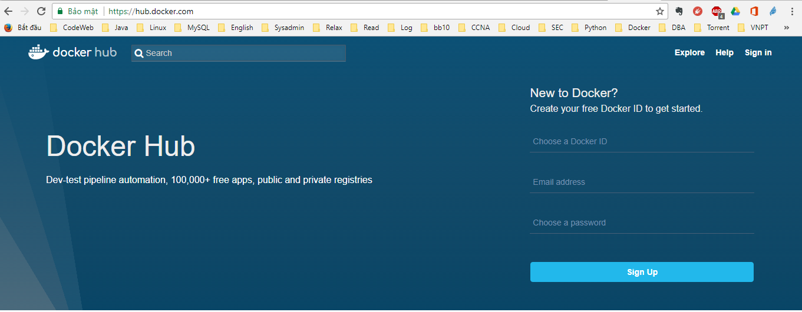
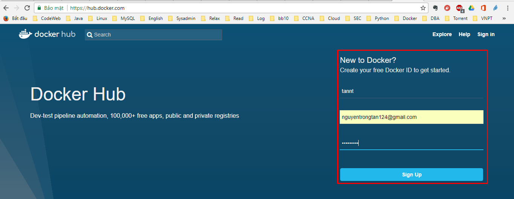
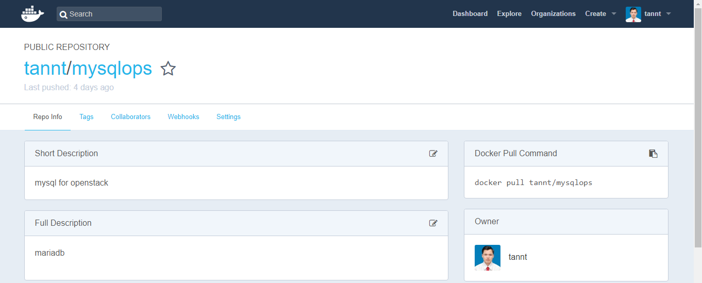

# Thực hành docker registry

## Đăng ký

Truy cập vào trang `hub.docker.com`



Điền thông tin vào form đăng ký



Mở email xác nhận đăng ký


Thực hiện đăng nhập để bắt đầu sử dụng


Nhấn vào `Create repository` để tạo mới một repo lưu image bạn mong muốn



------------------------

## Thực hành

Trên host, cần đăng nhập vào docker hub để có thể push được image. Chạy lệnh sau và nhập username/password tương ứng.
```sh
docker login
```

Giả sử bạn đang có một image về mysql, bạn cần push lên docker hub thì trước tiên phải đổi lại như sau:
```sh
docker tag [image_name] [username_hub]/[image_name]:[tag]
```

Ví dụ:
```sh
docker tag apache_test tannt/apache_test:1.0
```

Nếu bạn không gắn `tag` thì mặc định là `latest`. Bây giờ bạn push lên docker hub của bạn
```sh
docker push [username_hub]/[image_name]:[tag]
```

Ví dụ:
```sh
docker push tannt/apache_test:1.0
```

**Note**: trong trường hợp image_name chưa có trên docker hub thì lúc bạn push lên, sẽ tự tạo ra một repository mới

Khi một người dùng muốn sử dụng image vừa được bạn tải lên, sẽ sử dụng lệnh `pull`:
```sh
docker pull tannt/apache_test:1.0
```